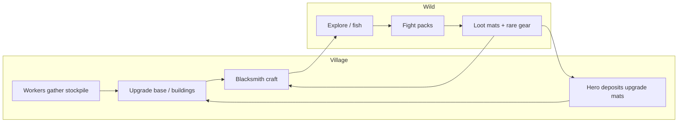
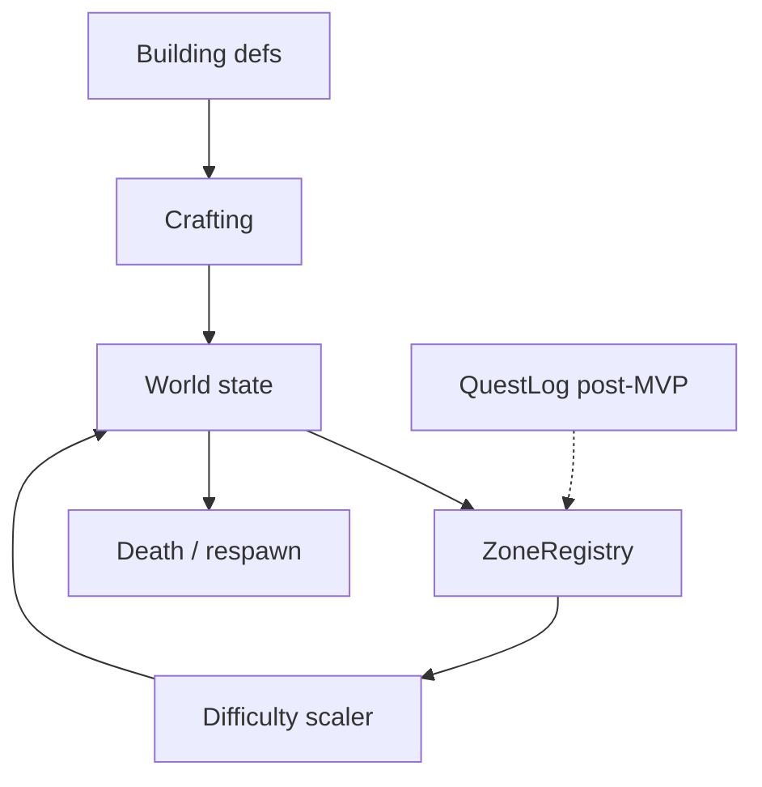
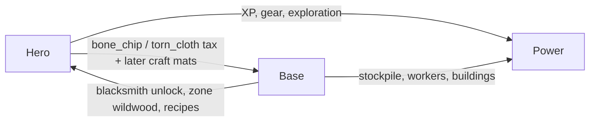
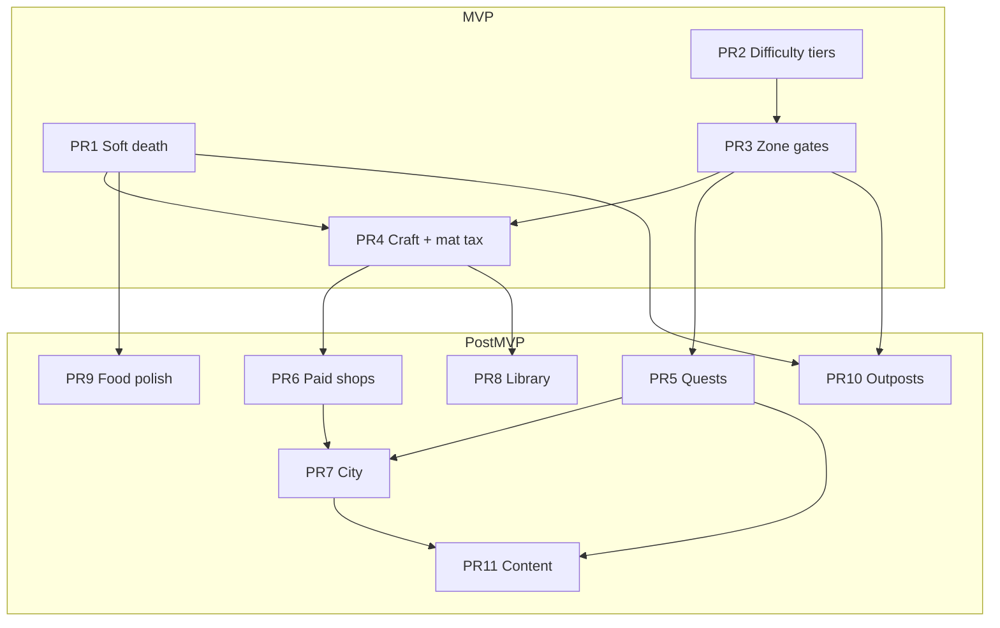

# Game Vision: Chill Hero × Base Symbiosis

| Field | Value |
|--------|--------|
| **Project** | world-app (`iso-base`) |
| **Stack** | Vite + TypeScript + Canvas 2D isometric, single-player, client-only (Vercel static) |
| **Document** | Product / systems design (game direction) |
| **Audience** | Senior engineer implementing incremental PRs against `src/` |
| **Status** | Draft v2 — revision after design review; maps to save key `iso-base-save-v11` |
| **Related code** | `src/config.ts`, `src/world/World.ts`, `src/systems/*`, `src/items/*`, `src/ui/*` |
| **MVP cut** | **PR1–PR4** (soft death, distance tiers, base/skill zone gates, blacksmith craft). Quests/cities/library/outposts are **post-MVP**. |

---

## Overview

This game is a **chill progression adventure** where a single hero explores a chunked isometric world while a light RTS-style village economy supports them. Pillars mix deliberately:

| Pillar | What we take |
|--------|--------------|
| Economy & building | Workers, stone/wood/food stockpile, base upgrades, blacksmith, construction |
| Combat & skills | 0.6s game ticks, melee accuracy rolls, skill XP, fishing, soft death |
| Gear & inventory | Equipment slots, bags, rarity, equip requirements |

**Core thesis:** the hero and the base are symbiotic. The hero brings wild materials that the village *requires* to grow (and later to craft); the base unlocks buildings, recipes, and zone access that let the hero push farther. Progress is gated by **where** you can go (zones) and **what** your village has unlocked — not by army spam or hardcore death.

---

## Background & Motivation (current codebase state)

### What already works

The runtime is a single `World` (`src/world/World.ts`) driven by `Game` (`src/game/Game.ts`):

1. Continuous movement each frame (`updateMovement`)
2. Discrete game ticks every `CONFIG.gameTickSec` (0.6s) via `advanceClock` / `processGameTick` (`src/systems/GameTick.ts`)
3. Canvas render + minimap + HTML HUD / inventory / shop panels

| System | Location | Current behavior |
|--------|----------|------------------|
| **Config** | `src/config.ts` | `chunkSize: 32`, `maxChunkRadius: 8`, workers, combat leash, fishing, bags, save key |
| **Map gen** | `src/world/MapGen.ts` | Home chunk (0,0) safe with base, workers, resources, pond; wild chunks get resources, optional packs |
| **Exploration** | `src/systems/Exploration.ts` | Vision radius 8, chunk streaming (`ensureChunksAround` 3×3), fog + enclosed-pocket fill |
| **Combat** | `src/systems/Combat.ts` | Fight queue, pack join, camp leash (`enemyLeashDistance: 10`), alternating melee turns, skill XP |
| **Production** | `src/systems/Production.ts` | Worker gather/deposit loop, train workers, base upgrade (levels 0→3), blacksmith place/build |
| **Skills** | `src/systems/Skills.ts` | Attack / Strength / Defense / Fishing, cumulative XP curve to 99 |
| **Inventory** | `src/systems/Inventory.ts`, `src/items/*`, `src/ui/inventory.ts` | Paper-doll, bags, gear bonuses; **`raw_fish` is eatable for +3 HP** |
| **Loot** | `src/systems/Loot.ts` | Material-biased drops, rare gear chance, coin purse (not bag slots) |
| **Fishing** | `src/systems/Fishing.ts` | Spot stock, tick catch timer, respawn near water |
| **Shop** | `src/ui/shop.ts` | Free dev vendor (`Npc` role `'shop'`) next to base |
| **Save** | `World.toJSON` / `fromJSON`, `Game.save`/`load` | Full dump to `localStorage` under `CONFIG.saveKey` |
| **UI time** | `src/ui/hud.ts` | Pause/Play only (no speed multiplier control) |

### Gaps relative to the vision

| Gap | Reality today |
|-----|----------------|
| **Hero death** | On kill, `hero.alive = false` + message *“You have been defeated.”* — a **soft-lock**: combat/exploration/input early-out while workers may still run. **Does not** set `status = 'lost'` (Defeat overlay only for `won`/`lost` in `hud.ts`). No respawn, no soft cost. |
| **Spatial difficulty** | `ENEMY_SPECIES` stats are flat (all ~hp 5, maxHit 1). Wild packs vary species/count slightly by near-home, but not by distance tier. |
| **Zone gating** | Any walkable tile within `maxChunkRadius` is free once streamed. No level/base/quest gates. |
| **Base → hero unlocks** | Blacksmith requires `base.upgradeLevel >= 1` to *place*, but completed blacksmith has no craft UI or recipes. Upgrade levels mostly cosmetic / gate placeholder. |
| **Hero → base mats** | Upgrades/train spend **stockpile only** (`CONFIG.baseUpgrade*`). Inventory mats (`bone_chip`, `torn_cloth`) never feed the village. |
| **Quests / cities** | None. One free test NPC. (**Post-MVP** structure; not required for chill combat loop.) |
| **Crafting / mat sinks** | No craft UI. **`bone_chip` / `torn_cloth` have no sink.** `raw_fish` already heals +3 HP via inventory click (`inventory.ts`). |
| **Data-driven content** | Zones, loot tiers, quests, buildings largely hardcoded in TS modules. |
| **Win / lose** | `GameStatus` includes `'won'` (unused) and `'lost'` (set only if base dies — **unreachable** today: combat never targets base). |
| **Item prices** | `ItemDef` has no buy/sell value; shop is free Take-only. |

These gaps define the design work below — extend existing patterns rather than rewrite the loop.

---

## Goals & Non-Goals

### MVP goals (PR1–PR4)

1. **Chill progression** — death is a soft setback; exploration and base play remain rewarding after failure.
2. **Hero ↔ base symbiosis** — hero inventory mats tax base upgrades; base unlocks blacksmith craft and zone access.
3. **Zone gating + spatial difficulty** — farther from home is harder; `wildwood` locked until base + skills (or gear alternate).
4. **Hero-driven adventure** supported by RTS-lite economy (workers gather/build; no army spam).
5. **Shippable incremental PRs** — each phase playable; content largely data tables.

### Post-MVP goals (PR5+)

6. **Quests and cities** as mid-game structure and trade hubs without multiplayer economy.
7. Library, outposts, paid economy polish, deeper content.

### Non-Goals (design horizon)

- Multiplayer, accounts, or server authority
- Full RTS army control / unit formations beyond workers
- Hardcore death (loot wipe, large XP loss, permanent gear break)
- Real-time PvP or auction house
- Procedural quest graph AI; hand-authored + data tables is enough
- Overhauling the 0.6s tick model or abandoning Canvas 2D
- Base raids / siege combat in MVP (home stays safe)

---

## Player Fantasy & Tone

**Fantasy:** You are a frontier settler-hero. Your village is a lighthouse on the edge of fog. You walk out into danger, return with materials and stories, and the village grows — which lets you walk farther.

**Tone:** Calm, readable, slightly cozy combat. Threat is real enough that gear and base matter, but failure never feels punishing. UI stays sparse (stockpile, selection panel, inventory, soft messages).

**Session shape:** 10–40 minutes. Train a worker, fish a bit, kill a pack one chunk out, return mats for base upgrade, craft a sword, push into wildwood (~**one session** to first wildwood unlock is the pacing target).

---

## Core Loop



**Micro loop (seconds–minutes):** move → fight/fish intent → tick resolves → loot/XP → inventory (eat fish if needed).

**Meso loop (minutes) — MVP:** stockpile + hero mats → upgrade base → place/finish blacksmith → craft gear → open wildwood → harder packs.

**Macro loop (post-MVP):** quest chains → city unlock → outposts → higher base level → deep zones.

---

## Proposed Design

### Design pillars

1. **Soft failure** — never brick a save; death costs minutes, not hours.
2. **Two-body progress** — hero power *and* village level both required to push content.
3. **Distance = difficulty** — the map itself is the difficulty curve.
4. **Data over code** — zones, gates, recipes, quests as tables consumed by thin systems.
5. **Workers support, hero stars** — economy is logistics for the adventure, not the main verb.

### Systems map (target)



---

## World structure (zones, difficulty, gates)

### Chunks today

- Home: chunk `(0,0)` fully explored, no packs (`generateHomeChunk`).
- Wild: `generateWildChunk(seed, cx, cy)` with `nearHome = max(|cx|,|cy|) <= 1` tweaking pack chance/size.
- Soft bound: `CONFIG.maxChunkRadius` (8) — chunks outside do not load.
- Streaming: `Exploration.updateExploration` → `ensureChunksAround` preloads a **3×3** chunk neighborhood. Missing tiles are not walkable (`isWalkable` needs `tileAt` + `!blocked`).

### Zone rings (design)

Define **Chebyshev distance** from home: `ring = max(|cx|, |cy|)`.

| Zone ID | Rings | Theme | Typical content | Gate | Available when |
|---------|-------|--------|-----------------|------|----------------|
| `home` | 0 | Safe village | Resources, pond, base, NPCs | **none** (always) | MVP |
| `outskirts` | 1 | Gentle wild | Cows, weak goblins, streams | **none** (always open) | MVP |
| `wildwood` | 2–3 | Real combat | Mixed packs, better mats | Base ≥ 1 **AND** (Attack ≥ 10 **OR** Defense ≥ 10 **OR** any iron-tier equip) | MVP (PR3) |
| `frontier` | 4–5 | Hard packs | Higher HP/maxHit | **MVP:** no hard gate (tier only). **Post-MVP (PR5+):** base ≥ 2 **AND** quest `scout_frontier` | PR2 tier / PR5 gate |
| `deep` | 6–8 | Endgame-ish | Elite packs, rare craft mats | **MVP:** no hard gate (tier only). **Post-MVP:** base ≥ 3 **OR** quest chain `deep_charter` (never pure RNG rare-gear alone) | PR2 tier / PR5+ gate |

**Pacing:** Target **~1 session (≤40 min)** to unlock wildwood: base upgrade (stockpile + mat tax) + combat skills to 10 *or* craft/equip iron gear via blacksmith (PR4 strengthens the gear alternate path).

### Gate enforcement model (Key Decision — authoritative)

**Chosen model:** *load terrain always; suppress hostiles until enterable; clamp hero at ring boundary.*

| Layer | Behavior |
|-------|----------|
| **Terrain load** | `ensureChunksAround` / `loadChunk` **always** generate tiles for fog, pathing continuity, minimap. Never refuse load solely because of a gate (refusing load = hard void with no bump message). |
| **Hostile content** | When generating a wild chunk, if `!canEnterChunk(world, cx, cy)` at generation time **or** content is marked gated: **suppress packs** (and later elite loot tables). Store `chunkMeta[cx,cy].hostilesSuppressed = true`. |
| **Late unlock** | When the player later becomes eligible, either (a) spawn packs on first eligible enter via a one-shot `populateChunkHostiles`, or (b) if chunk was explored while gated, leave it sparse until a refresh rule (prefer **one-shot populate on first successful enter** — simple). |
| **Movement clamp** | On path goals and continuous movement: if the hero’s **destination tile** or **next tile** lies in a chunk where `!canEnterChunk`, cancel/clamp to last legal tile and set a **throttled** `world.message` (e.g. once per 2s) with `formatGateFailure(gate)`. |
| **Re-check** | Gates are **recomputed every check** from live state (base level, skills, equipped items, later quest flags). Never trust a sticky “unlocked forever” cache alone (though one-shot hostile populate is fine). |
| **Already-loaded saves** | Old free-roam saves may have packs in high rings. PR3 does **not** purge them; new clamps only block further entry if requirements fail. Optional later: despawn packs in illegally entered rings — out of MVP. |
| **CONFIG** | `CONFIG.enableZoneGates = true` once PR3 lands. |

**Hooks (not only `loadChunk`):**

1. `World.ensureChunksAround` / `loadChunk` — terrain always; pack spawn gated.
2. `issueMove` / hero intent apply in `GameTick.applyPlayerIntents` — clamp goals.
3. Continuous `updateMovement` — optional last-line clamp if order path steps into gated chunk.
4. `canEnterChunk(world, cx, cy)` / `evaluateGate(world, gate)` in `src/data/zones.ts` + thin `src/systems/Zones.ts`.

### Data contract — zones & gates

```ts
/** All listed fields AND together. Nested `anyOf` is OR. Empty gate = always pass. */
export type GateRequirement = {
  baseLevel?: number;
  /** Every listed skill must meet min level (AND). */
  skillsAll?: Partial<Record<'attack' | 'strength' | 'defense' | 'fishing', number>>;
  /** At least one skill in this list meets its min (OR group). */
  skillsAny?: Partial<Record<'attack' | 'strength' | 'defense' | 'fishing', number>>;
  /** At least one equipped item whose defId is in this list (OR). */
  equippedAnyOf?: string[];
  /** Post-MVP: every quest id must be completed. */
  questsAll?: string[];
  /** Post-MVP: at least one quest completed. */
  questsAny?: string[];
  /** Human template; `{missing}` filled by evaluator. */
  failMessage?: string;
};

export interface ZoneDef {
  id: 'home' | 'outskirts' | 'wildwood' | 'frontier' | 'deep';
  minRing: number;
  maxRing: number;
  /** Maps to TIER_MULT / createEnemy scaling. */
  difficultyTier: number;
  /** PR3: only base/skills/equip. Quest fields ignored until PR5. */
  gate: GateRequirement;
}

/** Example — wildwood (MVP-complete). */
export const WILDWOOD_GATE: GateRequirement = {
  baseLevel: 1,
  skillsAny: { attack: 10, defense: 10 },
  equippedAnyOf: [
    'iron_sword', 'iron_shield', 'iron_helm', 'iron_greaves', 'iron_boots',
    'chain_chest', /* iron-tier set ids as catalog grows */
  ],
  failMessage:
    'Wildwood: need Base Lv1 and (Attack 10 or Defense 10 or iron gear). {missing}',
};

export const ZONES: ZoneDef[] = [
  { id: 'home', minRing: 0, maxRing: 0, difficultyTier: 0, gate: {} },
  { id: 'outskirts', minRing: 1, maxRing: 1, difficultyTier: 1, gate: {} },
  { id: 'wildwood', minRing: 2, maxRing: 3, difficultyTier: 2, gate: WILDWOOD_GATE },
  // MVP: open (tier only). PR5+ attaches quest gates.
  { id: 'frontier', minRing: 4, maxRing: 5, difficultyTier: 3, gate: {} },
  { id: 'deep', minRing: 6, maxRing: 8, difficultyTier: 4, gate: {} },
];

// Evaluation: recompute every call; no persistent unlock set required for MVP.
function evaluateGate(world: World, gate: GateRequirement): { ok: true } | { ok: false; missing: string }
```

**Composition rules:** top-level fields are **AND**. `skillsAny` / `equippedAnyOf` / `questsAny` are internal **OR** groups. Wildwood = baseLevel AND (skillsAny OR equippedAnyOf) — implement as: if both `skillsAny` and `equippedAnyOf` present, pass if **either** group passes (documented special case for this zone), else AND all groups. Explicit code:

```ts
// Wildwood-style: baseLevel required AND (skillsAny OR equippedAnyOf)
// General evaluator: (baseLevel?) AND (skillsAll?) AND (questsAll?)
//   AND (skillsAny empty OR pass) AND (equipped empty OR pass) AND (questsAny empty OR pass)
// For wildwood gear alternate: put skills and gear both as optional OR by using a single
// helper `passCombatAttunement = skillsAnyOk || equippedAnyOk` in the wildwood zone check.
```

Simpler implementer rule for MVP: `canEnterWildwood = base.upgradeLevel >= 1 && (atk>=10 || def>=10 || hasIronEquip())`. Encode that either as special-case in zone id or as:

```ts
gate: {
  baseLevel: 1,
  // Custom: evaluator treats skillsAny + equippedAnyOf as one OR-group when both set
  skillsAny: { attack: 10, defense: 10 },
  equippedAnyOf: ['iron_sword', 'iron_shield', 'iron_helm', 'iron_greaves', 'iron_boots', 'chain_chest'],
}
```

### Spatial difficulty (PR2)

Ship a **single** scaling path — no pack tables / loot tables in PR2.

```ts
// src/data/difficulty.ts
export function tierFromRing(ring: number): number {
  if (ring <= 0) return 0;
  if (ring === 1) return 1;
  if (ring <= 3) return 2;
  if (ring <= 5) return 3;
  return 4;
}

/** Multipliers applied in World.createEnemy after ENEMY_SPECIES base. */
export const TIER_MULT: Record<number, { hp: number; maxHitAdd: number }> = {
  0: { hp: 1, maxHitAdd: 0 },
  1: { hp: 1, maxHitAdd: 0 },
  2: { hp: 1.5, maxHitAdd: 1 },
  3: { hp: 2.2, maxHitAdd: 2 },
  4: { hp: 3, maxHitAdd: 3 },
};
```

- Scale **HP** and **maxHit** only in `World.createEnemy` (final stats already saved on the entity).
- Keep species definitions flat; keep pack size/species weights as today’s MapGen `nearHome` logic until PR11 polish.
- **No** `packTableId` / `lootTableId` in MVP ZoneDef (removed from contract above).
- **Save note:** existing far-chunk enemies stay at old stats until those chunks are regenerated (new game / not loaded). No migration pass in PR2.

### Outposts (stretch — post-MVP PR10)

Player-built or quest-unlocked **outposts** at ring edges: secondary respawn, optional local tier −1, construction like blacksmith. Out of MVP.

---

## Hero ↔ Base symbiosis

### Early material loop (Key Decision — authoritative)

**Chosen path:** **Base upgrade to level 1+ requires a hero inventory mat tax** in addition to stockpile costs. Blacksmith placement still requires base ≥ 1 (existing). Crafting (PR4) is the second hero→base/world loop (mats → gear).

| Upgrade step | Stockpile (existing CONFIG) | Hero inventory tax (new) |
|--------------|----------------------------|---------------------------|
| 0 → 1 | stone 100, wood 80, food 50 | **3× `bone_chip` + 2× `torn_cloth`** removed from bags |
| 1 → 2 | same stockpile knobs (tunable) | **5× `bone_chip` + 3× `torn_cloth`** |
| 2 → 3 | same | **8× `bone_chip` + 5× `torn_cloth` + 20 copper** |

- **Flow:** `canUpgradeBase` / `startBaseUpgrade` also checks inventory counts; on start, consume items then stockpile (same as today’s stockpile debit). Fail with one message listing missing mats *and* stockpile.
- **Hero must be alive**; no range requirement for upgrade start (village action from HUD) — mats are already in bags from adventuring.
- **Why not blacksmith-completion tax:** base upgrade is the single choke every player hits before blacksmith; mat tax there guarantees hero play feeds the village before craft UI exists. Blacksmith then spends more mats on recipes (PR4).

### Dependency graph



### Concrete symbiosis table

| Base level | Unlocks for hero / village | How hero feeds base |
|------------|----------------------------|---------------------|
| **0** (start) | Train workers, gather, fishing, outskirts open | Kill/fish for mats and food heal; stockpile from home nodes |
| **1** | Blacksmith placement; craft commons/uncommons; **wildwood gate** | Paid upgrade tax (chips/cloth); craft spends more mats |
| **2** (post-MVP) | Library (manuals); better recipes; frontier quest gate | Higher tax + quest turn-ins |
| **3** (post-MVP) | Outpost kit; elite recipes; deep gate (base **or** quest) | Highest tax + rare craft mats |

Today: `CONFIG.baseMaxLevel = 3`, upgrade costs in `CONFIG`, multi-worker build in `updateBaseUpgrade`. Design keeps that spine; each level gains **content unlocks** plus the mat tax above.

### Building roles

| Building | Status | Design role |
|----------|--------|-------------|
| **Base** | Exists | Hub, train, upgrade (+ mat tax), stockpile, **only** respawn in MVP |
| **Blacksmith** | Place/build only | Craft UI (PR4): recipes gated by base level + dual-currency inputs |
| **Library** | Post-MVP | **v1 effect (fixed):** sell 3 manuals granting fixed skill XP (Attack/Strength/Defense +50 XP each). No cooking skill in library v1. |
| **Walls / Watchtower** | Stretch | Cosmetic; defer |
| **City structures** | Post-MVP | Fixed POI content, not player-built first pass |

### Blacksmith interaction UX (PR4)

Mirror NPC shop pattern in `Input.ts`:

| State | Gesture | Result |
|-------|---------|--------|
| Completed blacksmith | **RMB** (or LMB interact) within **2.5 tiles** of building center | Open craft panel (`CraftUi`, mirror `ShopUi`) |
| Incomplete blacksmith | RMB / select | Selection panel shows build %; message *“Still under construction.”* — no craft |
| Out of range RMB | — | Message *“Move closer to the Blacksmith.”* |

- `CONFIG.blacksmithBuildSeconds` is **300** (~5 min at 1× with one builder) — long for playtest; add `CONFIG` note to optionally lower to **60–90** during development (`enableFastBuild` boolean optional).
- Hero-only craft; workers do not operate the smith in MVP.

---

## Combat & Death (chill — light setback only)

### Combat (keep)

Retain the tick-based combat loop in `Combat.ts`:

- Player-initiated fights (species `aggroRadius: 0` today)
- Fight queue + same-pack join (`fightGroupRadius`)
- Camp leash (`enemyLeashDistance: 10`) → escape without death
- Alternating hero/enemy swings, gear + skills via `Inventory.estimateMaxHit` / hit rolls
- Defense XP on being hit; Attack/Strength on dealing damage

**Tuning direction:** spatial tier scaling (PR2); keep leash and non-aggro defaults.

### Soft death cost (Key Decision — authoritative)

When `hero.hp <= 0`:

| Rule | Spec |
|------|------|
| **Primary cost** | Lose **copper-equivalent** from wallet: `min(CONFIG.deathCoinCostCopper, totalWalletCopper)`. Default **`deathCoinCostCopper = 25`**. Convert gold/silver→copper for the calc; debit from copper first, then silver, then gold. If wallet total is 0, cost is 0 (still respawn — never stuck). |
| **Secondary cost** | **Wounded debuff:** `woundedUntilTick = tickCount + CONFIG.deathWoundedTicks` (default **10** ticks ≈ 6s). While wounded, hero accuracy **×0.9** (−10%). |
| **Never** | Gear loss, bag wipe, XP loss, stockpile damage, worker death, `status = 'lost'`. |
| **HP** | Full heal to `maxHp` at respawn. |
| **Location** | Teleport to base spawn (`base.spawnX/Y` or walkable tile beside footprint). |
| **Cleanup** | `clearHeroCombat`, `clearFishing`, clear `pendingMove` / `pendingAttackId` / `pendingFishId`, `order = none`, `alive = true`, `applyHeroStats`. |
| **Mid-death save** | `fromJSON`: if hero exists and `!hero.alive` → call `respawnHero` immediately (no stranded soft-lock). |
| **UI** | Message e.g. *“You fall… (−Nc. Wounded briefly.)”* — **not** Defeat overlay (that path is `status` won/lost only). |
| **CONFIG knobs** | `deathCoinCostCopper`, `deathWoundedTicks`, `deathAccuracyMult` (0.9). |

### Base HP / lose state

- Combat does **not** target the base today; `status = 'lost'` is effectively dead code.
- **v1 product rule:** base is **non-interactive for damage** (do not wire enemy→base attacks). Keep `base.hp` fields for future sieges only.
- **Do not** surface Defeat overlay as a normal end state in player-facing MVP design. Optionally stop setting `lost` entirely until sieges exist (implementation may leave the check inert).

### Respawn implementation sketch

- New `respawnHero(world)` in `src/systems/Death.ts` (or `Combat.ts`).
- Immediate respawn (no long gray-screen); optional half-second message is enough for chill.
- Re-enable exploration path (`updateExploration` requires `hero.alive`).

---

## Skills, Gear, Crafting

### Skills

| Skill | Exists | Use |
|-------|--------|-----|
| Attack | Yes | Hit chance / equip / wildwood alternate |
| Strength | Yes | Max hit / equip |
| Defense | Yes | Mitigation / max HP / wildwood alternate |
| Fishing | Yes | Catch speed |

**Cooking / new skills:** post-MVP (Library or later). Raw fish already heals; no blocking need for Cooking in MVP.

### Gear

Keep paper-doll (`EquipKey`, bags, rarity). Craft (PR4) is the reliable path; drops stay exciting (`normalMobGearDropChance: 0.04`; normal gear rolls exclude `rare`).

### Material sinks

| Material | Source | Sink (MVP) | Sink (post-MVP) |
|----------|--------|------------|-----------------|
| `bone_chip`, `torn_cloth` | Mob loot | **Base upgrade tax** + **blacksmith recipes** | Sell at paid shops |
| `raw_fish` | Fishing | **Eat for +3 HP** (exists) | Stronger cooked food (PR9) |
| Stone/wood/food | Workers | Upgrade, train, craft stockpile inputs | City trade |
| Coins | Loot | **Death fee**, later shops | Trainer fees |

### Crafting — dual currency (PR4)

Recipe inputs are a tagged union; **all** inputs required or craft fails with one message listing deficits.

```ts
export type RecipeInput =
  | { type: 'stockpile'; resource: 'stone' | 'wood' | 'food'; amount: number }
  | { type: 'item'; defId: string; amount: number }
  | { type: 'coins'; copper: number };

export interface RecipeDef {
  id: string;
  name: string;
  minBaseLevel: number;
  inputs: RecipeInput[];
  output: { defId: string; quantity: number };
  /** Short channel; 0 = instant. Cancel if hero moves or leaves range. */
  craftTicks: number;
}
```

| Rule | Spec |
|------|------|
| **Range** | Hero within 2.5 tiles of completed blacksmith for entire craft |
| **Stockpile** | Shared village stockpile (workers deposit; hero need not stand at base for stockpile portion — only smith range) |
| **Inventory** | Deduct stacks via existing inventory helpers; no partial craft |
| **UI** | List recipes; disabled rows show missing inputs; confirm spends all at start of channel |

Example recipes:

| Recipe | Base lvl | Inputs | Output |
|--------|----------|--------|--------|
| Iron Sword | 1 | stone 20, bone_chip×3 | `iron_sword` |
| Iron Helm | 1 | stone 15, torn_cloth×2 | `iron_helm` |
| Steel Axe | 2 | wood 30, bone_chip×5, 15 copper | `steel_axe` |
| King's Blade | 3 (post) | rare mats + quest flag | `kings_blade` |

---

## Quests, Cities, Trade (post-MVP)

> **MVP does not include quests or cities.** Spec below is the PR5+ contract so gates can compose later without redesign.

### Data contract — quests

```ts
export type QuestStatus = 'available' | 'active' | 'completed'; // no failed state in v1

export type QuestStep =
  | { type: 'talk'; npcRole: 'shop' | 'quest' | 'trainer'; npcName?: string }
  | { type: 'kill'; species?: 'cow' | 'goblin' | 'human'; count: number; anyEnemy?: boolean }
  | { type: 'gather_item'; defId: string; count: number }
  | { type: 'fish'; count: number }
  | { type: 'upgrade_base'; minLevel: number }
  | { type: 'craft'; recipeId: string }
  | { type: 'reach_ring'; minRing: number };

export interface QuestDef {
  id: string;
  title: string;
  steps: QuestStep[]; // sequential
  rewards: {
    xp?: Partial<Record<'attack' | 'strength' | 'defense' | 'fishing', number>>;
    items?: { defId: string; quantity: number }[];
    coinsCopper?: number;
    /** e.g. zone id keys only as documentation — prefer questsAll on ZoneDef */
    unlocks?: string[];
  };
  requires?: { questIds?: string[]; baseLevel?: number };
}

/** Example */
export const CLEAR_PACK: QuestDef = {
  id: 'clear_pack',
  title: 'Clear the outskirts',
  steps: [{ type: 'kill', anyEnemy: true, count: 3 }],
  rewards: {
    items: [{ defId: 'bone_chip', quantity: 2 }],
    coinsCopper: 30,
    xp: { attack: 25 },
  },
  requires: { questIds: ['welcome'] },
};

/** Persist */
// world.questLog: Record<string, { status: QuestStatus; stepIndex: number; counters: Record<string, number> }>
```

Gates **recompute** from `questLog` statuses; do not duplicate zone unlocks in `unlocks` unless a recipe flag is needed.

### Starter chain (PR5)

1. `welcome` — talk to vendor → 50 copper  
2. `first_fish` — catch 3 raw fish → fishing XP  
3. `clear_pack` — kill 3 enemies → chips + coins  
4. `upgrade_home` — base level ≥ 1 → flavor XP  

### Cities (PR7)

Walk-to POI (e.g. chunk `(3,0)` “Riverford”); paid shops; gate base ≥ 2 or quest. No teleport.

### Trade / prices (PR6)

**Chosen:** `src/data/prices.ts` map (not fields on every `ItemDef`):

```ts
/** Copper buy price; sell = floor(buy * SELL_RATIO). Missing id → unsellable / no buy. */
export const ITEM_BUY_COPPER: Record<string, number> = {
  bone_chip: 3,
  torn_cloth: 3,
  raw_fish: 5,
  rusty_sword: 40,
  iron_sword: 120,
  // …
};
export const SELL_RATIO = 0.4;
```

Wallet already supports gold/silver/copper (`CoinPurse`). Free shop: `CONFIG.freeDevShop = import.meta.env.DEV` (or explicit boolean).

---

## Data Model / save implications

### Existing save surface (`World.toJSON`)

Persists: seed, tiles, chunks, explored, stockpile, coins, inventory, entities, ids, fish respawns, status.

### Additions

| Field | When | Purpose |
|-------|------|---------|
| `woundedUntilTick` | PR1 | Soft death debuff end tick |
| `deathCount` | PR1 optional | Telemetry / future |
| `chunkMeta` | PR3 | e.g. `hostilesPopulated` flags |
| `questLog` | PR5 | Quest state machine |
| `saveVersion` | any break | Integer; also bump `CONFIG.saveKey` when incompatible |

**Rule:** Prefer **deriving** gate pass/fail from `base.upgradeLevel` + skills + equipment + questLog over storing `unlockedZones`.

**Migration:** defensive `??` in `fromJSON`; if `!hero.alive` → `respawnHero`.

### Entity / type extensions

- `Npc.role`: `'shop' | 'quest' | 'trainer'` (post-MVP)
- Library/outpost: **copy blacksmith pattern** first (Key Decision: ship speed over generalized `Building` until 3+ types hurt)

### Config booleans (feature switches — no framework)

```ts
// Add as systems land; default true when that PR merges
enableSoftDeath: true,
enableZoneGates: true,
enableCrafting: true,
freeDevShop: true, // production: false or DEV-only
enableFastBuild: false, // playtest: true → shorter blacksmith/upgrade seconds
```

Death/economy knobs: `deathCoinCostCopper: 25`, `deathWoundedTicks: 10`, `deathAccuracyMult: 0.9`, upgrade mat tax amounts.

---

## Alternatives Considered

### Genre / product

| Alternative | Why rejected / deferred |
|-------------|-------------------------|
| **Hardcore death** | Conflicts with chill pillar |
| **Pure RTS with army** | Dilutes hero fantasy |
| **Roguelike base wipe** | Fights long local saves |
| **Server MMO zones** | Out of stack |
| **Fully open world, no gates** | Weak goals; soft-lock risk low but structure missing |
| **Workers auto-fight** | Scope + tone |

### Technical forks (chosen defaults)

| Fork | Options | **Chosen** | Why |
|------|---------|------------|-----|
| **Gate enforcement** | Refuse `loadChunk` void wall vs load terrain + clamp + suppress packs | **Load terrain + suppress packs + clamp path + message** | Fog continuity; implementable with `ensureChunksAround`; clear feedback |
| **Death primary cost** | Consumables vs coins vs debuff-only | **25 copper fee + 10-tick −10% accuracy; full HP; no gear loss** | Predictable; empty wallet still respawns; chill |
| **Early symbiosis** | Mat tax on upgrade vs tax on blacksmith complete vs “mats only post-craft” | **Inventory mat tax on base upgrade 0→1+** | Hero play required before blacksmith; works pre-PR4 |
| **Buildings model** | Generalized `Building` vs copy blacksmith | **Copy blacksmith for Library/outpost until painful** | Ship speed |
| **Free shop** | Always free vs DEV-only | **`CONFIG.freeDevShop` / DEV for free catalog; paid in production PR6** | Avoid breaking playtest |
| **Cooking** | Now vs later | **Later (post-MVP)**; raw fish already +3 HP | MVP focus combat/base/craft |
| **Deep unlock** | Rare gear equip vs base/quest | **Base ≥ 3 OR quest (post-MVP); never RNG-only** | Soft-lock avoidance |
| **MVP scope** | Include quests/cities in v1 ship | **MVP = PR1–PR4 only** | Prove chill loop first |

---

## Risks

| Risk | Impact | Mitigation |
|------|--------|------------|
| Scope creep (quests/cities before loop proven) | Unshippable | **MVP cut at PR4**; PR5+ explicitly post-MVP |
| Save breakage | Frustration | `saveKey` bumps; defensive `fromJSON`; dead-hero auto-respawn |
| Gate frustration | Rage quit | Always message `{missing}`; outskirts open; no RNG-only deep |
| Difficulty scaling wrong | Too easy/hard | Small `TIER_MULT` table; home safe |
| Craft UI complexity | Drag | Mirror `ShopUi`; static recipes |
| Death/respawn intent bugs | Soft-lock | Central `respawnHero`; clear fishing + pending intents |
| Wildwood too slow | Chill pacing fail | ~1 session target; iron-gear OR skill path after PR4 |
| Performance | Frame drops | Chunked world; modest entity counts |

---

## Rollout / implementation phasing

### MVP (ship gate)

| Phase | PR | Theme | Player-visible outcome |
|-------|-----|--------|------------------------|
| **M0** | PR1 | Soft death | Die → base, small copper loss, brief wound, keep gear |
| **M1** | PR2 | Distance tiers | Farther packs hit harder |
| **M2** | PR3 | Zone gates | Terrain visible; wildwood blocked until base+skill/gear |
| **M3** | PR4 | Blacksmith craft | Reliable gear; mat sinks |

### Post-MVP

| Phase | PR | Theme |
|-------|-----|--------|
| **C1** | PR5 | Quests v1 + frontier/deep quest gates |
| **C2** | PR6 | Paid shops + prices.ts |
| **C3** | PR7 | City POI |
| **B1** | PR8 | Library manuals |
| **E1** | PR9 | Stronger food / sell mat polish |
| **S1** | PR10 | Outposts |
| **P1** | PR11 | Loot tables, balance, optional soft credits |

---

## Open Questions

*Resolved by this revision (kept for history): death cost, gate model, early mat tax, MVP cut, outskirts open, deep no RNG-only, fish heal exists, free shop DEV flag, copy-paste buildings, cooking later.*

Still open (non-blocking):

1. **Should workers operate only on home chunk forever?** Today economy is home-centric (`isHomeTile`); outposts may need deposit rule changes (PR10).
2. **Win condition:** optional soft credits quest vs endless sandbox? (Recommend: soft credits + sandbox continues, post-MVP.)
3. **Populate suppressed hostiles:** one-shot on first enter vs regenerate chunk — recommend one-shot spawn helper.

---

## Key Decisions

| Decision | Choice | Rationale |
|----------|--------|-----------|
| **MVP cut** | **PR1–PR4 only** | Prove soft death + tiers + gates + craft before quests/cities |
| **Genre blend** | Hero adventure + RTS-lite base | Existing systems; workers support, hero stars |
| **Death** | Respawn base, full HP; **min(25 copper-eq, wallet)**; **10-tick 90% accuracy**; no gear/XP wipe; load auto-respawns dead hero | Chill; single unambiguous PR1 acceptance |
| **Gate enforcement** | Always load terrain; suppress packs until enterable; clamp path + throttled message; recompute gates live | Fits `ensureChunksAround`; fog + feedback |
| **PR3 gates** | Base/skills/equip only; **outskirts open**; frontier/deep **tier-only until PR5** | Ship without quest system |
| **Deep unlock (post-MVP)** | Base ≥ 3 **OR** quest — never rare-gear-only | Avoid soft-locks / RNG walls |
| **Wildwood pacing** | ~1 session; base≥1 AND (Atk/Def 10 OR iron equip) | Chill sessions; craft participates post-PR4 |
| **Early symbiosis** | **Upgrade mat tax** (bone_chip/torn_cloth) on base level 1+ | Hero loot feeds village before craft UI |
| **Craft currency** | Tagged inputs: stockpile \| item \| coins; hero in smith range | Clear UI and failure messages |
| **Prices** | `src/data/prices.ts` buy copper + 40% sell | Keep catalog combat-focused |
| **Craft vs drop** | Craft reliable, drops exciting | Matches 4% gear drop + material bias |
| **Content model** | `src/data/*` + thin systems | PR-friendly |
| **Feature switches** | Simple `CONFIG` booleans | No flag framework in repo |
| **Buildings** | Copy blacksmith pattern first | Ship speed |
| **Base damage** | Non-interactive in v1; no player-facing lose | Chill; lose path unreachable today |
| **Library v1** | Three XP manuals only | Avoid vague “skill stubs” |
| **Cities / quests** | Post-MVP walk-to POI + hand-authored quests | After combat loop proven |
| **Save strategy** | Extend JSON; derive gates; bump `saveKey` on break | Matches `toJSON`/`fromJSON` |
| **Time controls** | Pause/Play only | Product choice |
| **Combat core** | Keep ticks, leash, queues | Existing investment |
| **Difficulty PR2** | `tierFromRing` + `TIER_MULT` on createEnemy only | Small shippable slice |

---

## PR Plan

Each PR: `npm run build` green, game playable. Use `CONFIG` booleans when incomplete UI would confuse (no separate flag system).

**Tracks (parallel where noted):**

| Track | PRs | Theme |
|-------|-----|--------|
| **A — Combat / world** | 1, 2, 3 | Death, tiers, gates |
| **B — Economy** | 4, then 6 & 9 | Craft, shops, food polish |
| **C — Narrative** | 5, 7 | Quests, city |
| **D — Buildings** | 8, 10 | Library, outposts |
| **E — Polish** | 11 | Content |

### PR1 — Soft hero death & respawn ✅ MVP

- **Title:** `feat(combat): soft death — respawn at base with copper fee + wound`
- **Files:** `src/systems/Death.ts` (new) or `Combat.ts`, `GameTick.ts`, `World.ts`, `config.ts`, `toJSON`/`fromJSON`; hit-roll path reads `woundedUntilTick`
- **Dependencies:** None
- **Description:** On HP≤0: debit copper fee, set wound ticks, `respawnHero` at base spawn, full HP, clear combat/fishing/pending intents. Load path auto-respawns if `!alive`. Do not set `status = 'lost'`.
- **Acceptance criteria:**
  - Die mid-fight → within ~1s hero at base spawn, `alive`, gear intact, can move/fight again.
  - Wallet ≥25 copper → lose 25 copper-eq; wallet 0 → still respawn.
  - 10 ticks of reduced accuracy then normal.
  - Die mid-fish → fishing cleared; no stuck timer.
  - Save while dead (if possible) or load old dead save → hero alive at base.
  - Defeat overlay does **not** appear (status stays `playing`).

### PR2 — Spatial difficulty tiers ✅ MVP

- **Title:** `feat(world): scale enemy HP/maxHit by chunk ring tier`
- **Files:** `src/data/difficulty.ts` (new), `World.createEnemy`, optionally MapGen only if needed for ring plumbing
- **Dependencies:** None (parallel with PR1)
- **Description:** `tierFromRing` + `TIER_MULT`; apply in `createEnemy`. Home unchanged. No loot/pack table rewrite.
- **Acceptance criteria:**
  - Ring-1 cow weaker or equal stats vs ring-4 spawn of same species (HP/maxHit visibly higher far out).
  - New game only for far enemies (document: old saves keep old mob stats).
  - Home chunk still has zero packs.

### PR3 — Zone registry & entry gates ✅ MVP

- **Title:** `feat(world): zones with terrain load + movement clamp + hostile suppress`
- **Files:** `src/data/zones.ts`, `src/systems/Zones.ts`, `World.loadChunk` / pack spawn, `Movement`/`GameTick`/`Input` clamp, `config.enableZoneGates`
- **Dependencies:** PR2 recommended; PR1 optional
- **Description:** Implement enforcement model above. **Wildwood** gate = base/skills/equip only. Outskirts open. Frontier/deep no hard gate. Throttled fail message.
- **Acceptance criteria:**
  - Walk to ring 2 with base 0 → path clamps; message explains missing base/skills; fog/terrain still appears.
  - After base 1 + Atk 10 (or iron equip), enter wildwood; packs can populate.
  - Outskirts always enterable at game start.
  - Gates re-check if base level somehow invalid (no sticky unlock).

### PR4 — Blacksmith crafting UI & recipes ✅ MVP (ends MVP)

- **Title:** `feat(craft): blacksmith recipes, dual-currency inputs, craft panel`
- **Files:** `src/data/recipes.ts`, `src/systems/Crafting.ts`, `src/ui/craft.ts` (mirror shop), `Input.ts` RMB, `Production` upgrade mat tax if not earlier, `config.ts` tax amounts
- **Dependencies:** PR1 recommended (death mid-craft); mat tax may land here or a tiny PR3.5 — **include upgrade mat tax in PR4 if not shipped earlier** (prefer with PR4 so PR3 stays world-only, or ship tax in a prerequisite commit inside PR4)
- **Description:** Completed blacksmith RMB opens recipes; spend stockpile+items+coins; iron recipes enable wildwood gear alternate. Wire **base upgrade inventory tax**.
- **Acceptance criteria:**
  - Cannot start base 0→1 without stockpile **and** 3 bone_chip + 2 torn_cloth.
  - With completed smith + mats, craft `iron_sword` into inventory.
  - Missing inputs → one clear message; no partial debit.
  - Out of range → cannot craft.
  - Incomplete smith → no craft panel.

### PR5 — Quest log + starter chain (post-MVP)

- **Title:** `feat(quests): quest definitions, state, starter chain`
- **Files:** `src/data/quests.ts`, `src/systems/Quests.ts`, `World.questLog`, HUD list, hooks kill/fish/talk/upgrade
- **Dependencies:** PR3 for attaching frontier/deep gates; else narrative-only
- **Description:** Sequential steps; rewards; optional zone gates for frontier/deep.
- **Acceptance criteria:** Accept `welcome` → complete `clear_pack` kill 3 → rewards applied; quest panel shows active step; reload preserves progress.

### PR6 — Paid shops & prices (post-MVP)

- **Title:** `feat(shop): prices.ts paid vendor; freeDevShop flag`
- **Files:** `src/data/prices.ts`, `shop.ts`, coin helpers
- **Dependencies:** PR4 helpful
- **Description:** Buy/sell copper; `freeDevShop` for free catalog.
- **Acceptance criteria:** Buy iron costs copper; sell bone_chip at 40% buy; free shop off when flag false.

### PR7 — City POI (post-MVP)

- **Title:** `feat(world): Riverford city POI`
- **Files:** MapGen/loadChunk overlay, NPCs, zone/quest hooks
- **Dependencies:** PR3, PR5, PR6
- **Acceptance criteria:** Walk to city chunk; open paid shop; quest NPC available when gated.

### PR8 — Library manuals (post-MVP)

- **Title:** `feat(build): library sells three skill manuals`
- **Files:** blacksmith-like building, HUD build tab, base ≥ 2
- **Dependencies:** PR4 patterns
- **Acceptance criteria:** Place/complete library at base ≥ 2; buy Attack Manual → +50 Attack XP.

### PR9 — Food / mat sink polish (post-MVP; parallel-friendly)

- **Title:** `feat(items): stronger food tiers and sell-focused mat UX`
- **Files:** catalog, inventory use, optional cook-at-base action
- **Dependencies:** PR1; PR6 for sell
- **Description:** Improve on existing +3 raw fish (not introduce healing from zero). Optional cooked +8 HP.
- **Acceptance criteria:** Cooked fish heals more than raw; raw still works.

### PR10 — Outposts (stretch)

- **Title:** `feat(world): outposts as secondary respawn`
- **Dependencies:** PR1, PR3, building patterns
- **Acceptance criteria:** Found outpost; death offers / uses outpost spawn; nearby tier −1 optional.

### PR11 — Content polish (post-MVP)

- **Title:** `chore(content): loot tiers, more recipes/quests, README`
- **Dependencies:** MVP complete; ideally PR5–7
- **Acceptance criteria:** Midgame has ≥1 extra quest and balanced `TIER_MULT` pass notes in README.



---

## References

### Codebase (authoritative for current behavior)

| Path | Role |
|------|------|
| `src/config.ts` | Tunables: ticks, chunks, workers, combat, fishing, bags, save key, `ENEMY_SPECIES` |
| `src/world/World.ts` | World state, entities, chunk load, serialize |
| `src/world/MapGen.ts` | Home/wild generation, packs, resources |
| `src/game/Game.ts` | Frame loop, save/load, pause |
| `src/systems/GameTick.ts` | Intent → combat → fish → production → explore → loot |
| `src/systems/Combat.ts` | Fights, leash, death soft-lock |
| `src/systems/Production.ts` | Workers, base upgrade, blacksmith |
| `src/systems/Skills.ts` | XP/levels |
| `src/systems/Inventory.ts` | Equip, stats, bags; fish tooltip |
| `src/systems/Loot.ts` | Drops, auto-pickup |
| `src/systems/Fishing.ts` | Fishing loop |
| `src/systems/Exploration.ts` | Fog / `ensureChunksAround` |
| `src/items/catalog.ts` | Item defs |
| `src/items/types.ts` | Equip slots, inventory shape (no price field) |
| `src/core/types.ts` | Entity unions, stockpile, coins |
| `src/ui/shop.ts` | Free test vendor |
| `src/ui/hud.ts` | Selection, train, upgrade, pause; overlay only for won/lost |
| `src/ui/inventory.ts` | Character sheet / bags; **raw_fish eat +3 HP** |
| `src/input/Input.ts` | RMB shop open pattern to mirror for blacksmith |

### Design pillars (summary)

- Discrete game ticks & skill-based combat feel
- Worker economy and tech tree unlocked by buildings
- Bag + equipment-slot progression

---

*End of design document (v2).*
